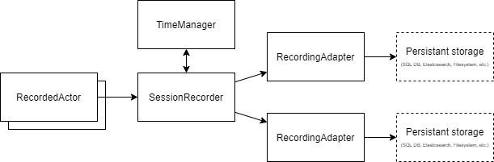
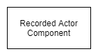
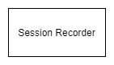
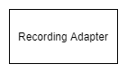
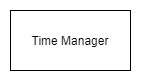
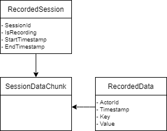

# UE4 Session Recorder

> A Unreal Engine 4 plugin for flexible game session recording

This plugin aim to allow flexible game recording at level scale.
Each session could be recorded on a persistant storage like a Database (SQL or NoSQL), a simple file.
This plugin is created with flexibility in mind and try to be used with any persistant storage and any game structure.

## Architecture

### Recording Structure

#### Recorded Actor Component

The `RecordedActorComponent` is the source of data during recording.
Each actor that produce data to be recorded must have this component attached and can use it to write data in the global recorded timeline.
This component defines the data produced by the actor and is used by the actor to produce the data.

#### Session Recorder

The `SessionRecorder` is the main object maaging the whole recording of a session.
A single instance of SessionRecorder is ceated by session in the level's `GameMode` object.

`SessionRecorder` collects all data produced by the actors throw `RecordedActorComponent` and store them in memory befor flushing them in the persistant storage throw all `RecordingAdapters`.

#### Recording Adapter

`RecordingAdapter` are objects in charge of data flush on persistant storage.
A persistant storage can be any king of storage (HardDrive, Network, In Memory, etc.).
Some `RecordingManagers` are built-in and you can create your own to handle custom persistant storage.

#### Time Manager

The `TimeManager` is a utility class used by the current `SessionRecorder` to timestamp each data.
By default, the `TimeManager` timestamp each data in mimiseconds since the session starts in game time.

The `TimeManager` Could be customized to timestamp each data with the current user time, for example.

### Data Structure

The data strucutre of a recording is produced as follow.

To avoid memory consumption for big recorded session, full data of a single session are not stored entirely in memory.
A session is composed of `SessionDataChunk` that contains a part of the full data recorded during the session.

#### A word on Ids

A session and each actor recorded have a unique Id.
these Ids are auto generated (GUID) on session starts.

The Id is the only data that can identify an actor and a session in the final recording.
Each data producesd by each actor are sored in the same dynamic Array and are not bound to any Actor object.
Only the actor id identifies where the data come from.